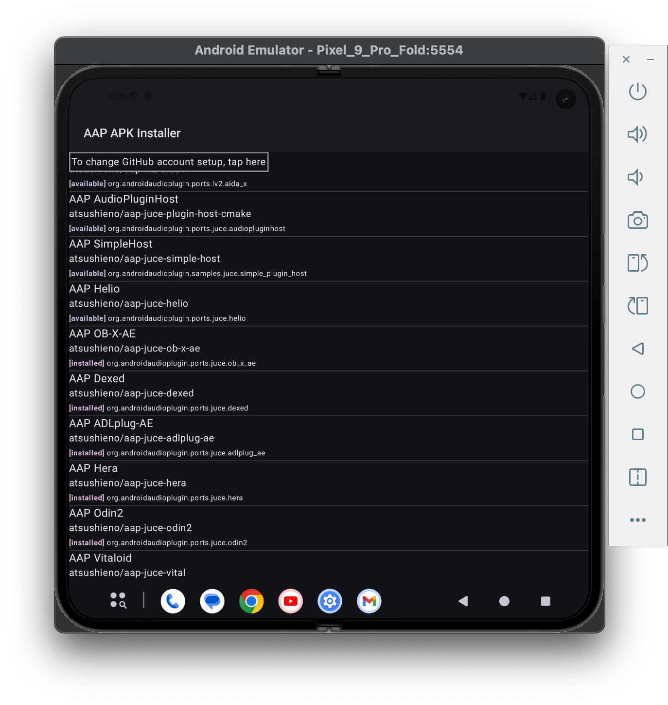

# What is this?

It started as a project started as my AAP APK Installer, and now it also works as a reusable application installer library.

[AAP (Audio Plugins For Android)](https://github.com/atsushieno/aap-core) is an (experimental) audio plugins framework for Android that comes with [various audio plugins](https://github.com/atsushieno/aap-core/wiki/List-of-AAP-plugins-and-hosts) as Android apps. Since it is annoying to install all those packages to a new device or emulator (for development) one by one using Android Studio, we want to have a simpler plugin "installer" application. **AAP APK Installer** is created for this purpose. It is like [Native Instrument's Native Access](https://www.native-instruments.com/en/specials/native-access-2/).

All what it does is to download the target APKs or AABs from our dedicated list and install them, and the core functionality is generalized to support *any* set of GitHub repositories that provide APKs or AABs by anyone. Therefore, a generalized **Android CI Package Installer** is split to an independent AAR so that anyone can reuse this installer utility.

## More on Rationale

We need something to facilitate testing existing audio plugins to provide easier access to experience the AAP ecosystem. Or, we sometimes need to demonstrate or "show off" what the current state of union is like, often on a dedicated "demo devices". Since we already have 20~ish audio plugin APKs and it's going to grow, it makes more sense to provide easier way to install those plugins, rather than going to each project to download an APK and install manually for 20+ repos.

Not [Firebase Testing](https://firebase.google.com/docs/app-distribution/android/distribute-gradle)? It is possible to distribute testing APKs and probably tooling works, but looks like we have to create one app per apk / repo, which is quite annoying to manage. We may use it for individual development, but not for this particular need.

[DeployGate](https://deploygate.com/?locale=en) offers simple and straightforward test app distribution that I love as a user (also it is run by friends), but the free tier offers 2 apps at most where we have 20+ (not sure if aggregated management is doable there either). So not for the individual plugins apps.

But we do indeed use DeployGate to distribute *this* application. You can find it at: https://dply.me/vl8vfr (you have to install DeployGate app first though).

## How to use it as a library

[The `app` project](https://github.com/atsushieno/android-ci-package-installer/blob/main/app/) is the sources for AAP APK Installer. It fills the AAP specific parts of the installer application (`MainActivity.kt` and `AndroidManifest.xml`). There is no Maven package yet, so just add your own project to your checkout and adjust your `settings.gradle` to include the library.

## Limitations (and/or, Rooms for Improvements)

I wanted to "batch install" multiple APKs, but as a general Android app, it can only "request" user to install i.e. `android.permission.REQUEST_INSTALL_PACKAGES`, not `android.permission.INSTALL_PACKAGES` like Google Play Store app or any other vendor-specific application store app can perform. That would be achieved by batch `adb install` command runs at host elsewhere.

It targets "artifacts" and "releases" nowadays. For GitHub Actions build artifacts, GitHub requires sign-in to download them. Therefore, Android-CI-Package-Installer requires GitHub account and a Personal Access Token to download those APKs. It works more like a development aid, not for end users.

Currently only GitHub Actions is supported, but it could be extended to any CI builds.

Currently only such a build artifact that contains an APK is supported.

Currently the target apps are listed in the hard-coded catalogs, but they can be extended to anything e.g. download catalogs, query at GitHub, everything for the logged user. The catalog information does not seem to be strictly examined at install time, but "Uninstall" operation on the UI depends on the precise package name.

Due to the AAP plugin ecosystem compatibility, the packages may vary depending on the AAP protocol version. It may be a good idea for us (or people like us) to provide multiple sets of catalogs. It may be just easier to provide multiple apps based on this codebase though.

Since we cannot get a lot of information about the target APK without downloading it, it is unlikely to happen that the catalog could be fully automatically filled. It is more likely that we expect some metadata text file in the source tree so that we can retrieve before downloading the artifact.

Graphical Design and UX is kind of horrible. It is not the taste I want to push - I'm just incapable. PRs for improvements are welcomed.

## Contributing

As listed above, there are many rooms for improvements and we welcome contributions. Since this application exists just as a side work for the entire AAP ecosystem, I have almost no motivation to improve general usability for *others*, so "feature requests" are likely ignored. Even bug reports may be ignored unless they are blocker *for me*. But filing them is welcomed nonetheless. And pull requests that actually achieves improvements are highly welcomed.

If you are going to send a pull request, we ask you to license your contribution under the MIT license.

We may change any of your code afterwards. Sometimes our changes are buggy and your contributions could get broken. We are not great developers, sorry, but please bear with us.

## Licenses

Android-CI-Package-Installer and AAP APK Installer are distributed under the MIT license.

Android-CI-Package-Installer heavily depends on [GitHub API for Java](https://github-api.kohsuke.org/) by Kohsuke Kawaguchi and other contributors. It is distributed under the MIT license.
